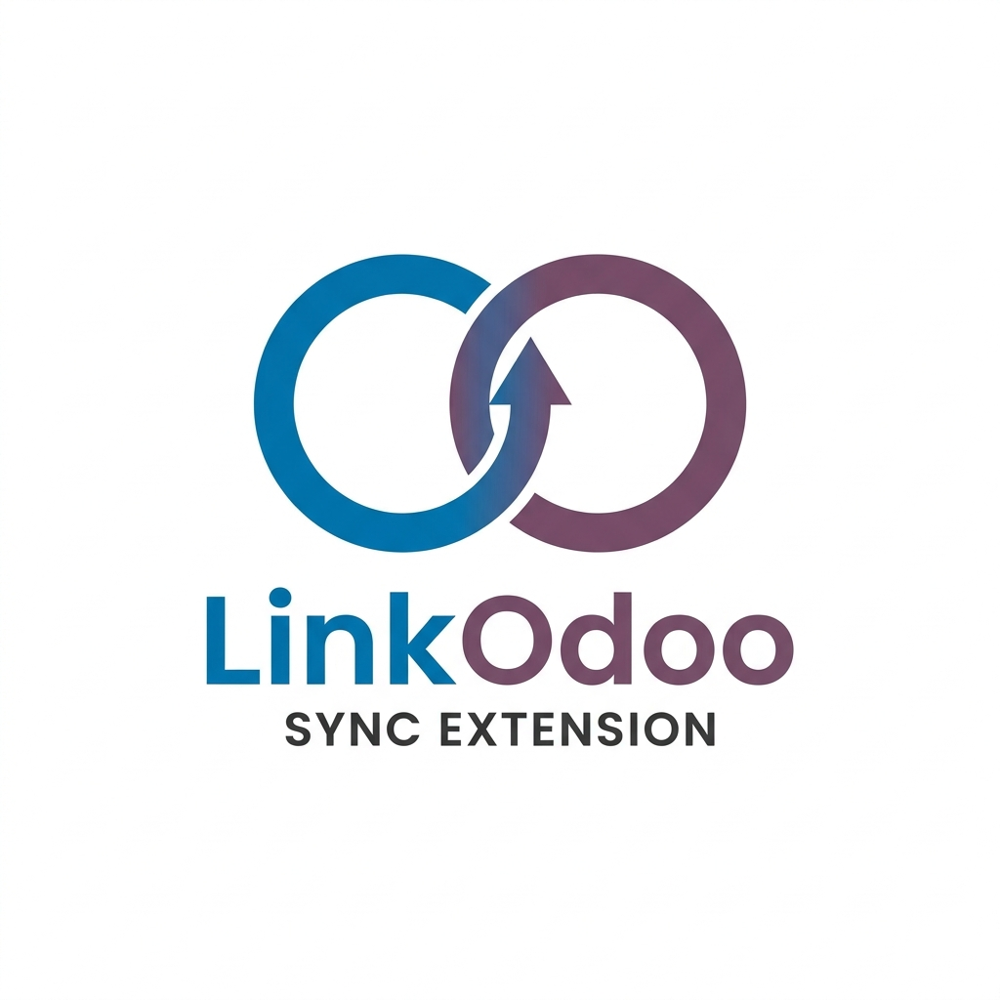

# LinkedIn to Odoo 18 Connector

Cette extension permet d'ajouter des contacts LinkedIn directement dans votre instance Odoo 18 CE (On-premise). Elle supporte la connexion classique par mot de passe/API Key ainsi que la synchronisation via une **session active dans le navigateur** (idéal si vous êtes déjà connecté à Odoo).

## Installation

### 🌐 Pour Google Chrome
1. Ouvrez Chrome et accédez à `chrome://extensions/`.
2. Activez le **Mode développeur** (interrupteur en haut à droite).
3. Cliquez sur **Charger l'extension non empaquetée**.
4. Sélectionnez le dossier racine de ce projet.

### 🦊 Pour Mozilla Firefox
1. Ouvrez Firefox et accédez à **`about:debugging#/runtime/this-firefox`**.
2. Cliquez sur **"Charger un module complémentaire temporaire..."**.
3. Sélectionnez le fichier **`manifest.json`** à la racine de ce projet.

---

## 📦 Packaging (Distribution)

Un fichier **`linkedin_odoo_extension.zip`** est disponible à la racine pour faciliter le partage.

---

## Configuration

1. Cliquez sur l'icône de l'extension pour ouvrir le volet latéral (Side Panel).
2. Cliquez sur l'icône **⚙️ (Réglages)**.
3. Choisissez votre mode de connexion :
   - **Session Navigateur (Recommandé)** : Entrez l'URL de votre Odoo et cliquez sur "Synchroniser avec le navigateur". L'extension utilisera votre session active.
   - **Mot de passe/API** : Entrez l'URL, la base de données, l'utilisateur et votre mot de passe ou clé API.

---

## Utilisation

1. Naviguez sur LinkedIn vers votre page de relations : `https://www.linkedin.com/mynetwork/invite-connect/connections/`.
2. Cliquez sur **Scanner la page LinkedIn** dans l'extension.
3. Pour chaque contact trouvé :
   - **Ajouter à Odoo** : Crée le contact dans Odoo.
   - **Existe** : S'affiche si le contact est déjà présent.

